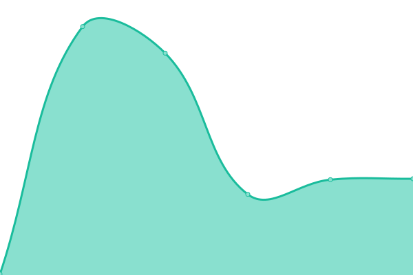
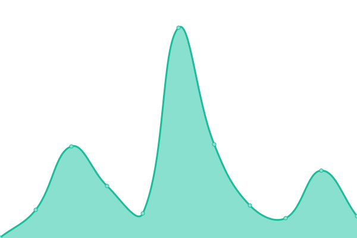

# [📈 Live Status](https://logotip4ik.github.io/up-time): <!--live status--> **🟩 All systems operational**

This repository contains the open-source uptime monitor and status page for [logotip4ik](https://bit.ly/bogdan-kostyuk), powered by [Upptime](https://github.com/upptime/upptime).

With [Upptime](https://upptime.js.org), you can get your own unlimited and free uptime monitor and status page, powered entirely by a GitHub repository. We use [Issues](https://github.com/logotip4ik/up-time/issues) as incident reports, [Actions](https://github.com/logotip4ik/up-time/actions) as uptime monitors, and [Pages](https://logotip4ik.github.io/up-time) for the status page.

<!--start: status pages-->
<!-- This summary is generated by Upptime (https://github.com/upptime/upptime) -->
<!-- Do not edit this manually, your changes will be overwritten -->
<!-- prettier-ignore -->
| URL | Status | History | Response Time | Uptime |
| --- | ------ | ------- | ------------- | ------ |
| [BogdanKostyuk](https://bogdankostyuk.vercel.app) | 🟩 Up | [bogdan-kostyuk.yml](https://github.com/logotip4ik/up-time/commits/master/history/bogdan-kostyuk.yml) | 

 169ms
     
 | 

   

| [Typist](https://typist.surge.sh) | 🟩 Up | [typist.yml](https://github.com/logotip4ik/up-time/commits/master/history/typist.yml) | 

 324ms
     
 | 

   

| [Rivne History](https://rivne-history.surge.sh) | 🟩 Up | [rivne-history.yml](https://github.com/logotip4ik/up-time/commits/master/history/rivne-history.yml) | 

 326ms
     
 | 

   

| [My journal](https://my-journal.vercel.app) | 🟩 Up | [my-journal.yml](https://github.com/logotip4ik/up-time/commits/master/history/my-journal.yml) | 

 134ms
     
 | 

   

| [My Server](https://todowebapp-f.herokuapp.com/) | 🟩 Up | [my-server.yml](https://github.com/logotip4ik/up-time/commits/master/history/my-server.yml) | 

 396ms
     
 | 

   

<!--end: status pages-->

[**Visit our status website →**](https://logotip4ik.github.io/up-time)

## 📄 License

- Code: [MIT](./LICENSE) © [logotip4ik](https://bit.ly/bogdan-kostyuk)
- Data in the `./history` directory: [Open Database License](https://opendatacommons.org/licenses/odbl/1-0/)
