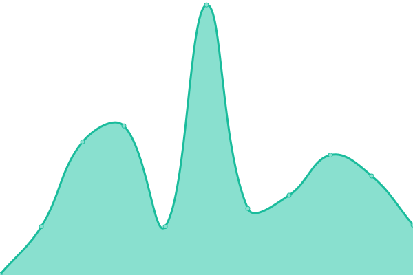
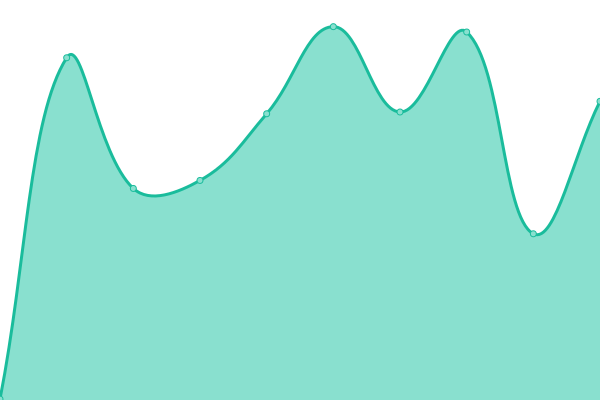
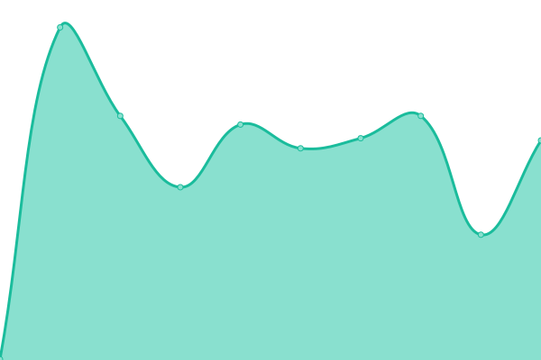

# [📈 Live Status](https://logotip4ik.github.io/up-time): <!--live status--> **🟧 Partial outage**

This repository contains the open-source uptime monitor and status page for [logotip4ik](https://bit.ly/bogdan-kostyuk), powered by [Upptime](https://github.com/upptime/upptime).

With [Upptime](https://upptime.js.org), you can get your own unlimited and free uptime monitor and status page, powered entirely by a GitHub repository. We use [Issues](https://github.com/logotip4ik/up-time/issues) as incident reports, [Actions](https://github.com/logotip4ik/up-time/actions) as uptime monitors, and [Pages](https://logotip4ik.github.io/up-time) for the status page.

<!--start: status pages-->
<!-- This summary is generated by Upptime (https://github.com/upptime/upptime) -->
<!-- Do not edit this manually, your changes will be overwritten -->

| URL                                               | Status  | History                                                                                               | Response Time                                                                       | Uptime                                                                                                                                                                                                                              |
| ------------------------------------------------- | ------- | ----------------------------------------------------------------------------------------------------- | ----------------------------------------------------------------------------------- | ----------------------------------------------------------------------------------------------------------------------------------------------------------------------------------------------------------------------------------- |
| [BogdanKostyuk](https://bogdankostyuk.vercel.app) | 🟩 Up   | [bogdan-kostyuk.yml](https://github.com/logotip4ik/up-time/commits/master/history/bogdan-kostyuk.yml) |  104ms |  |
| [Typist](https://typist.surge.sh)                 | 🟩 Up   | [typist.yml](https://github.com/logotip4ik/up-time/commits/master/history/typist.yml)                 |  322ms         |                  |
| [Rivne History](https://rivne-history.surge.sh)   | 🟩 Up   | [rivne-history.yml](https://github.com/logotip4ik/up-time/commits/master/history/rivne-history.yml)   |  409ms  |    |
| [My journal](https://my-journal.vercel.app)       | 🟩 Up   | [my-journal.yml](https://github.com/logotip4ik/up-time/commits/master/history/my-journal.yml)         |  48ms      |          |
| My Server                                         | 🟥 Down | [my-server.yml](https://github.com/logotip4ik/up-time/commits/master/history/my-server.yml)           |  0ms        |              |

<!--end: status pages-->

[**Visit our status website →**](https://logotip4ik.github.io/up-time)

## 📄 License

- Code: [MIT](./LICENSE) © [logotip4ik](https://bit.ly/bogdan-kostyuk)
- Data in the `./history` directory: [Open Database License](https://opendatacommons.org/licenses/odbl/1-0/)
